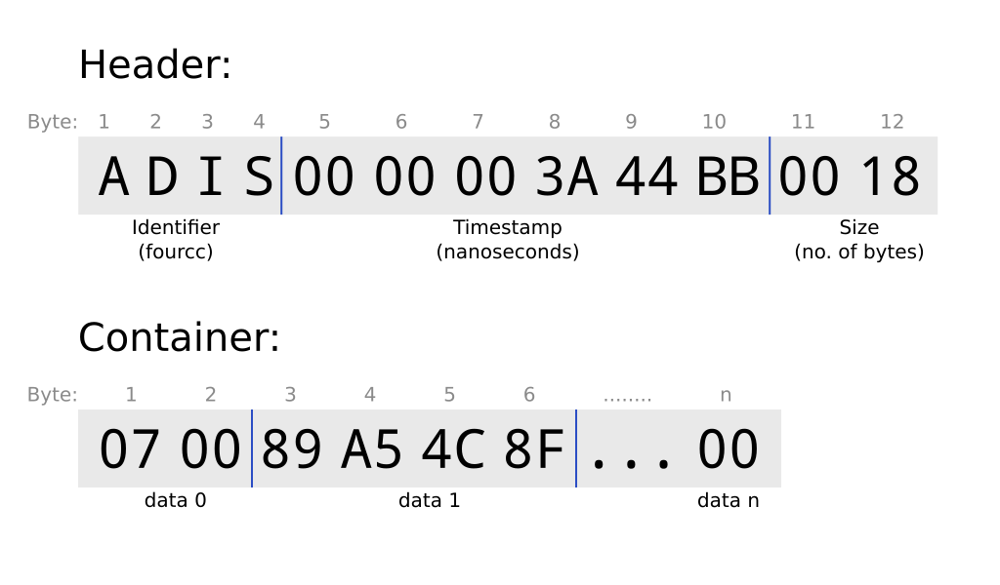

==============
Data Structure
==============

Container
=========

A collection of *Data*. Data are numbers or strings with no separators. It's
assumed that once you know what type of container you are looking at it can be
unpacked because its contents have been defined ahead of time. All PSAS types
have been defined in this project.

A container may be sent by itself over the network as a packet. Origin ip and
port information is used for identification. Otherwise a container is preceded
with a header is is called a *message*.

Message
=======

A PSAS Message has a header with an ASCII four character code (e.g., 'ADIS')
that identifies it. This is followed by a 6 byte timestamp in nanoseconds.
This is always nanosecond since beginning of a program, which
is usually the same as boot time for a device. This is followed by two bytes
that give the size of the rest of the message. The remainder of the message
is a *Container*.

    A Message with a header and pre-defined container
